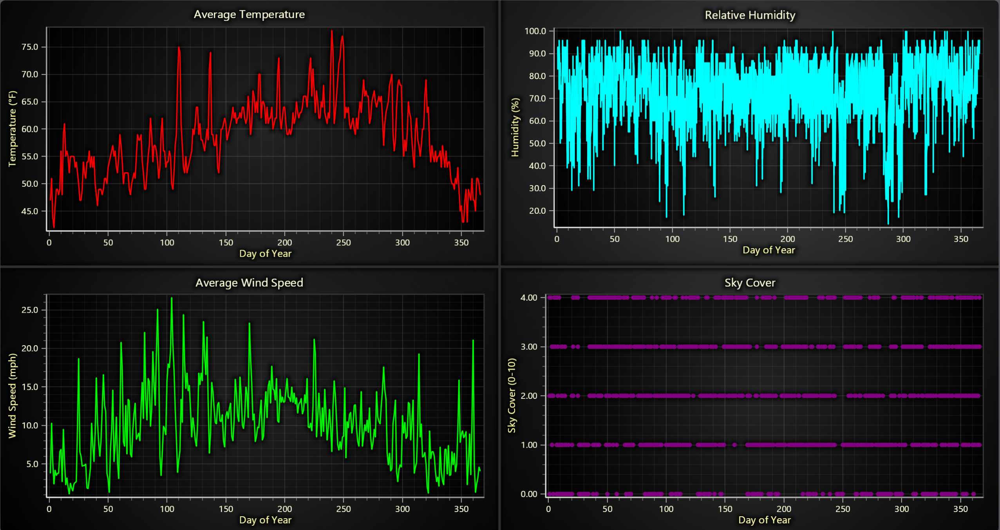
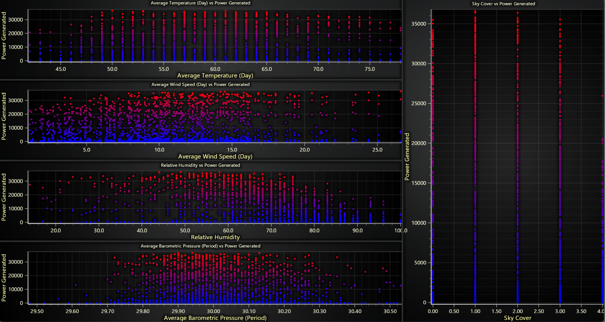
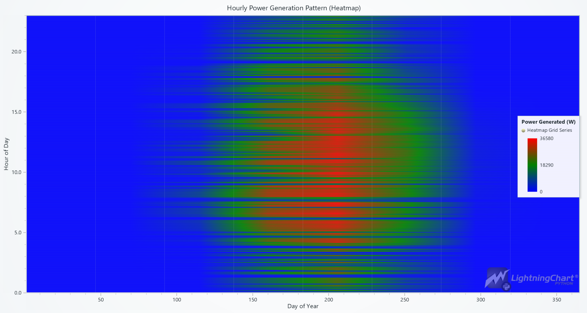
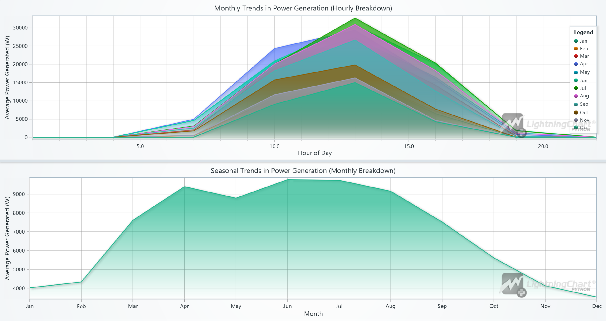
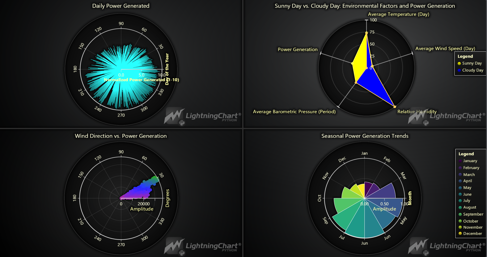
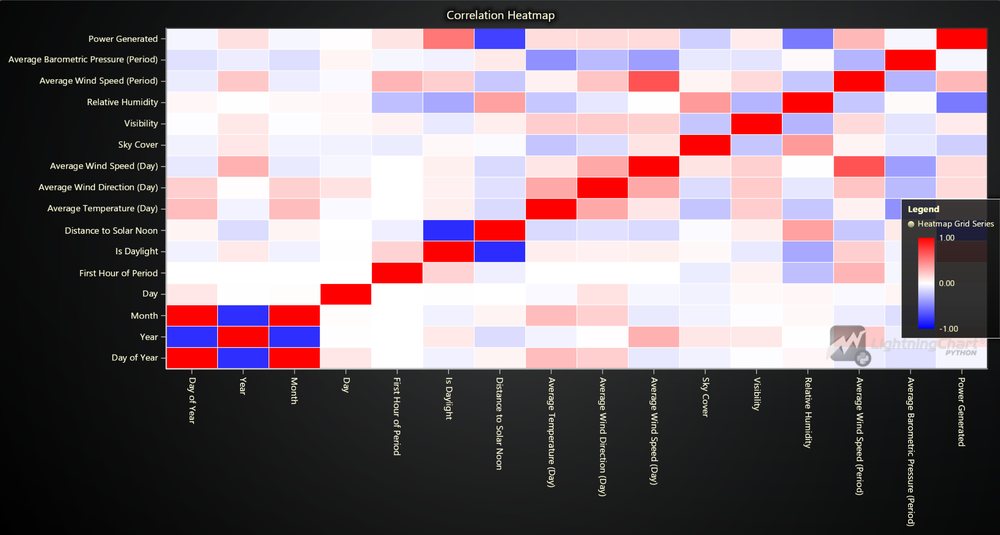
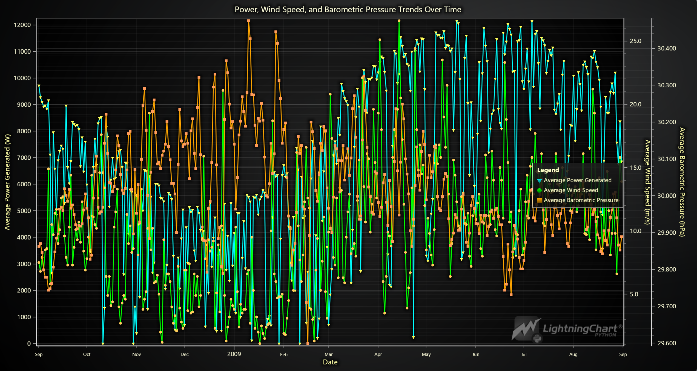

# Solar and Weather Conditions Analysis with LightningChart

## Introduction

### Introduction to Solar Power Modelling Python Analysis

Solar power modeling involves the use of computational techniques and tools to simulate and predict the energy output from solar photovoltaic systems. With the increase in renewable energy demands, accurate solar power generation prediction has become crucial for energy grid planning and ensuring efficient energy supply. Python, with its extensive libraries and frameworks, offers a powerful platform for modeling and analyzing solar power generation. In this article, we will explore how to use Python energy modeling for solar power, specifically using the LightningChart library for visualizing, analyzing and solar power generation prediction. (Chang et al., 2021)

### What is Solar Power Modelling?

Solar power modeling is a process of estimating and predicting the output of solar power systems based on various environmental factors such as temperature, wind speed, sky cover, and solar irradiance. These models help predict the amount of energy that a solar power plant can produce at a given time or location. By accurately predicting the power output, solar power modeling plays a vital role in power grid management and renewable energy optimization. (Al-Dahidi et al., 2024)

### Applications of Solar Power Modelling in Renewable Energy
- **Forecasting Power Generation**: Solar power modelling is used to predict energy output based on current and future environmental conditions.
- **System Optimization**: Understanding which environmental factors impact solar panel efficiency allows for optimizing energy production.
- **Energy Management**: Accurate solar power predictions help ensure that solar energy is efficiently integrated into the energy grid.
- **Maintenance Scheduling**: Solar power modelling helps predict periods of low energy production, which are ideal times for system maintenance.

This article focuses on solar power modelling in Python, providing an in-depth exploration of various visualizations for a solar power system installed in Berkeley, CA.

## LightningChart Python

### Overview of LightningChart Python

LightningChart is a high-performance charting library used for visualizing data in Python applications. It offers powerful tools for creating real-time visualizations, enabling users to interact with complex datasets seamlessly. In this project, we use LightningChart to visualize solar power generation data and gain insights from various environmental factors.

### Features and Chart Types to be Used in the Project

In this project, we utilize several chart types:
1. **Area Chart**: For visualizing seasonal and daily power generation trends.
2. **Point Line Chart**: A line chart with points marked on the line, ideal for tracking changes over time, such as Power, Wind Speed, and Barometric Pressure Trends Over Time.
3. **Treemap Chart**: This chart visualizes hierarchical data, such as power generation broken down by month, day, and hour, to provide a clear overview of energy distribution patterns.
4. **Heatmap Grid Chart**: Used to show correlation matrix and patterns of power generation across different hours and days, offering a detailed temporal overview.
5. **Polar Charts**: Visualize relationships between wind direction and power generation, as well as power generated under different environmental conditions.
6. **Gauge Charts**: A circular chart that resembles a speedometer, showing a single value within a range. It’s used to display metrics like power generation, providing a quick visual assessment of performance relative to a goal.
7. **Scatter Plots**: These plots show the correlation between environmental parameters like temperature, humidity, wind speed, and power generation.
8. **3D Mesh Models**: Used to create a visual representation of solar panel positioning and the sun's movement across the sky, providing a realistic view of solar energy capture.
9. **Real-Time Dashboards**: Dynamic, live-updating dashboards are used to simulate energy generation predictions based on changing environmental conditions.

### Performance Characteristics

LightningChart is known for its high-performance rendering, making it suitable for real-time data visualization. It can easily handle large datasets and offers fast rendering, even when multiple charts and dashboards are being displayed simultaneously. For solar power modelling, this performance ensures smooth interaction, such as zooming and panning through time series data or visualizing correlations between environmental variables.

## Setting Up Python Environment

### Installing Python and Necessary Libraries

To get started, ensure you have Python installed. Here you can see how to install the following libraries:

``` python
pip install lightningchart==0.9.3
pip install numpy pandas scikit-learn
```

### Overview of Libraries Used

Here you can see how to install the following libraries:
- **NumPy**: For numerical computations.
- **Pandas**: For data manipulation and handling.
- **LightningChart**: For charting and visualization.
- **Scikit-Learn**: For predictive modeling and machine learning applications.

### Setting Up Your Development Environment

1- Set up your development environment by creating a virtual environment and installing the necessary libraries. This ensures that your project dependencies are isolated and manageable.
``` python
 python3 -m venv venv
 source venv/bin/activate  # On Windows use `venv\Scripts\activate`
 pip install -r requirements.txt
```
2- Using Visual Studio Code (VSCode)

Visual Studio Code (VSCode) is a popular code editor that offers a rich set of features to enhance your development workflow.


## Loading and Processing Data

For this project, we use real data from a solar power system installed in Berkeley, CA. The dataset contains information such as daily solar power generated, weather conditions, and environmental factors. (Solar Power Generation, n.d.)

### How to Load the Data Files

We are working with a dataset that contains various weather conditions and solar power generation metrics, including:
- Average Temperature (Day)
- Average Wind Speed (Day)
- Sky Cover
- Relative Humidity
- Barometric Pressure
- Power Generated and so on

``` python
import pandas as pd
file_path = 'Dataset/SolarPower.csv'
data = pd.read_csv(file_path)
```

### Handling and Preprocessing the Data

Before visualizing, we need to preprocess the dataset to handle missing values and group data by relevant categories (like day, month, and hour). We'll also convert date-time data to a proper format using Pandas.

``` python
data['Date'] = pd.to_datetime(data[['Year', 'Month', 'Day']])
monthly_data = data.groupby('Month')['Power Generated'].mean()
```

## Visualizing Data with LightningChart

LightningChart allows us to create various visualizations to gain insights from the solar power data. Below are the types of charts we will create.

### Introduction to LightningChart for Python

LightningChart offers a robust set of visualization tools that are perfect for building real-time energy dashboards, simulating solar energy generation, and analyzing environmental impacts on energy production.

## Creating the Charts

### 1-Weather Conditions Dashboard:
- **Average Temperature**: The temperature fluctuates throughout the year with clear peaks during the summer months (mid-year) and lows in winter. The data shows a significant variance with spikes above 70°F and occasional drops below 50°F.
- **Relative Humidity**: Humidity appears to be quite variable, with spikes reaching near 100% consistently throughout the year, particularly in winter. There is also some noticeable decline in humidity during summer months.
- **Average Wind Speed**: Wind speed shows a consistent but fluctuating trend. It reaches higher values during certain periods, possibly indicating windy seasons (around mid-year and near the end).
- **Sky Cover**: This could indicate that most days have partial cloud cover, with very few days being fully overcast.

**Script Summary**:

``` python
dashboard = lc.Dashboard(rows=2, columns=2, theme=lc.Themes.Dark)

def create_line_chart(dashboard, row_index, column_index, title, x_values, y_values, y_axis_title, line_color):
    chart = dashboard.ChartXY(row_index=row_index, column_index=column_index)
    chart.set_title(title)
    chart.get_default_x_axis().set_title("Day of Year")
    chart.get_default_y_axis().set_title(y_axis_title)
    chart.add_line_series().add(x_values, y_values).set_line_color(line_color)

def create_point_chart(dashboard, row_index, column_index, title, x_values, y_values, y_axis_title, point_color):
    chart = dashboard.ChartXY(row_index=row_index, column_index=column_index)
    chart.set_title(title)
    chart.get_default_x_axis().set_title("Day of Year")
    chart.get_default_y_axis().set_title(y_axis_title)
    chart.add_point_series().add(x_values, y_values).set_point_color(point_color)

x_values = data['Day of Year'].tolist()

create_line_chart(dashboard, 0, 0, "Average Temperature", x_values, data['Average Temperature (Day)'].tolist(), "Temperature (°F)", lc.Color(255, 0, 0))
create_line_chart(dashboard, 0, 1, "Relative Humidity", x_values, data['Relative Humidity'].tolist(), "Humidity (%)", lc.Color('cyan'))
create_line_chart(dashboard, 1, 0, "Average Wind Speed", x_values, data['Average Wind Speed (Day)'].tolist(), "Wind Speed (mph)", lc.Color(0, 255, 0))
create_point_chart(dashboard, 1, 1, "Sky Cover", x_values, data['Sky Cover'].tolist(), "Sky Cover (0-10)", lc.Color(128, 0, 128))
```


**Significance of Results**:
- The high summer temperatures can potentially reduce solar panel efficiency despite longer daylight hours.
- High humidity levels, especially during the winter months, can signal a drop in power generation.
- Wind speed is mostly beneficial for cooling the panels, helping them perform better on windy days.
- Sky cover is a crucial factor. The spikes in sky cover (cloudiness) suggest power generation drops on cloudy days, confirming the need for predictive maintenance and energy storage planning.

### 2-Correlation of Power Generated and Weather Parameters:
- **Temperature vs Power Generated**: The points are concentrated more densely around mid-range temperatures (50°F–75°F), indicating that power generation tends to peak when temperatures are moderate. Extreme low or high temperatures result in lower power generation.
- **Wind Speed vs Power Generated**: Power generation seems slightly positively correlated with wind speed, but the effect is less pronounced than temperature.
- **Sky Cover vs Power Generated**: As expected, the power generation is much lower when sky cover is high. This strong inverse relationship is visualized clearly in the plot.
- **Relative Humidity vs Power Generated**: There is a weak inverse relationship between humidity and power generation, as higher humidity levels likely indicate cloud cover or rain.
- **Barometric Pressure vs Power Generated**: Higher pressure seems to result in higher power generation, though the correlation is not very strong.

**Script Summary**:

``` python
variables = ["Average Temperature (Day)", "Average Wind Speed (Day)", "Sky Cover", 
             "Relative Humidity", "Average Barometric Pressure (Period)", "Power Generated"]

data = data[variables].dropna().astype(float)

min_power, max_power = data["Power Generated"].min(), data["Power Generated"].max()

def get_color(value):
    ratio = (value - min_power) / (max_power - min_power)
    return lc.Color(int(255 * ratio), 0, int(255 * (1 - ratio)))

dashboard = lc.Dashboard(rows=4, columns=3, theme=lc.Themes.Dark)

def create_scatter_chart(dashboard, x_data, y_data, title, x_label, row_index, column_index, row_span, column_span):
    chart = dashboard.ChartXY(row_index=row_index, column_index=column_index, row_span=row_span, column_span=column_span)
    chart.set_title(title).set_padding(0).set_cursor_mode("show-pointed")
    for x, y, power in zip(x_data, y_data, data["Power Generated"]):
        chart.add_point_series().add([float(x)], [float(y)]).set_point_color(get_color(power)).set_point_size(5)
    chart.get_default_x_axis().set_title(x_label)
    chart.get_default_y_axis().set_title("Power Generated")

row_vars = ["Average Temperature (Day)", "Average Wind Speed (Day)", "Relative Humidity", "Average Barometric Pressure (Period)"]

for i, var in enumerate(row_vars):
    create_scatter_chart(dashboard, data[var].values, data["Power Generated"].values, f'{var} vs Power Generated', var, row_index=i, column_index=0, row_span=1, column_span=2)

create_scatter_chart(dashboard, data["Sky Cover"].values, data["Power Generated"].values, 'Sky Cover vs Power Generated', 'Sky Cover', row_index=0, column_index=2, row_span=4, column_span=1)

dashboard.open()
```


**Significance of Results**:
- These scatter plots allow us to quantify the impact of each weather factor on solar power generation.
- Moderate temperatures result in optimal power generation.
- Sky cover is one of the most significant factors in reducing power generation, supporting the idea of using these metrics for forecasting.
- Wind and humidity also play roles, albeit less prominent, in predicting power output. This correlation analysis can be used to train machine learning models to predict solar output based on weather conditions.

### 3-Hourly Power Generation Pattern:
- The heatmap shows that the most intense power generation occurs between 9 AM and 3 PM, with a peak around noon.
- The hottest (red) sections occur in the middle of the year (summer months), suggesting that more power is generated during this time of the year due to longer daylight hours.

**Script Summary**:

``` python
data = data[['Day of Year', 'First Hour of Period', 'Power Generated']].dropna()

heatmap_data = data.pivot_table(
    index='First Hour of Period', 
    columns='Day of Year', 
    values='Power Generated', 
    aggfunc='mean'
)

heatmap_array = heatmap_data.to_numpy()
heatmap_array[np.isnan(heatmap_array)] = 0  

chart = lc.ChartXY(title='Hourly Power Generation Pattern (Heatmap)', theme=lc.Themes.Light)

grid_size_x, grid_size_y = heatmap_array.shape
heatmap_series = chart.add_heatmap_grid_series(columns=grid_size_x, rows=grid_size_y)

heatmap_series.set_start(x=1, y=0).set_end(x=365, y=23).set_step(x=1, y=1)
heatmap_series.set_intensity_interpolation(True).invalidate_intensity_values(heatmap_array.tolist())

palette_steps = [
    {"value": heatmap_array.min(), "color": lc.Color('blue')},
    {"value": (heatmap_array.min() + heatmap_array.max()) / 2, "color": lc.Color('green')},
    {"value": heatmap_array.max(), "color": lc.Color('red')}
]

heatmap_series.set_palette_colors(steps=palette_steps, look_up_property='value', interpolate=True)

chart.get_default_x_axis().set_title('Day of Year')
chart.get_default_y_axis().set_title('Hour of Day')
chart.add_legend(data=heatmap_series).set_title('Power Generated (W)')
chart.open()
```


**Significance of Results**:
- This pattern confirms the expected diurnal cycle of solar power, with generation ramping up mid-morning, peaking around noon, and tapering off toward the evening.
- Operators can use this information for load balancing—knowing when solar power is available helps manage energy storage and distribution throughout the day.
- It also helps to schedule maintenance outside peak hours and optimize battery storage for when solar generation is low (e.g., at night).

### 4-Daily and Seasonal Trends in Power Generation:
- **Top Chart (Daily Trends)**: There is a consistent peak of power generation during midday (around 12 PM). However, there is considerable variance depending on the day, with some days having higher generation than others.
- **Bottom Chart (Seasonal Trends)**: The monthly breakdown shows a clear peak in summer months (April to July), with lower generation in winter (November to January).

**Script Summary**:

``` python
data['Date'] = pd.to_datetime(data[['Year', 'Month', 'Day']])
data = data[['Date', 'Month', 'First Hour of Period', 'Power Generated']]

monthly_hourly_data = data.groupby(['Month', 'First Hour of Period'])['Power Generated'].mean().unstack(fill_value=0)

dashboard = lc.Dashboard(rows=2, columns=1, theme=lc.Themes.Light)

daily_chart = dashboard.ChartXY(row_index=0, column_index=0, title="Monthly Trends in Power Generation (Hourly Breakdown)")
daily_chart.get_default_y_axis().set_title("Average Power Generated (W)")
daily_chart.get_default_x_axis().set_title("Hour of Day")
legend = daily_chart.add_legend()
month_labels = ['Jan', 'Feb', 'Mar', 'Apr', 'May', 'Jun', 'Jul', 'Aug', 'Sep', 'Oct', 'Nov', 'Dec']
for month in range(1, 13):
    series = daily_chart.add_area_series()
    series.set_name(month_labels[month - 1])
    series.add(list(monthly_hourly_data.columns), monthly_hourly_data.loc[month].values)
    legend.add(series)

seasonal_chart = dashboard.ChartXY(row_index=1, column_index=0, title="Seasonal Trends in Power Generation (Monthly Breakdown)")
seasonal_chart.get_default_y_axis().set_title("Average Power Generated (W)")
seasonal_chart.get_default_x_axis().set_title("Month")

monthly_data = data.groupby('Month')['Power Generated'].mean()
monthly_series = seasonal_chart.add_area_series()
monthly_series.set_name("Monthly Average Power Generation")
monthly_series.add(list(monthly_data.index), monthly_data.values)

x_axis = seasonal_chart.get_default_x_axis().set_tick_strategy('Empty')    
for i, month_name in enumerate(month_labels, start=1):
    custom_tick = x_axis.add_custom_tick().set_value(i).set_text(month_name)

dashboard.open()
```


**Significance of Results**:
- The daily trend chart highlights the importance of midday power generation, which is most likely when the sun is at its highest. On cloudy or rainy days, generation is lower.
- Seasonal trends reveal how the length of daylight and seasonal weather affect total solar output. Knowing this helps in long-term energy planning, as solar operators can adjust their energy usage or storage strategies during seasons of lower generation.

### 5-Polar/Radar Dashboard:
- **Daily Power Generated**: This chart shows a consistent daily generation with a peak mid-year, tapering off toward the end of the year.
- **Power Generated by Environmental Factors**: Power generation decreases significantly in cloudy days. It can be seen that wind Speed decreases a bit more in sunny weather than cloudy conditions.
- **Wind Direction vs Power Generation**: The power generated correlates with specific wind directions, likely due to environmental conditions.
- **Seasonal Power Generation Trends**: As expected, summer months (April to July) have significantly higher generation compared to winter months.

**Script Summary**:

``` python
dashboard = lc.Dashboard(theme=lc.Themes.Dark, rows=2, columns=2)

# Chart 1: Polar Area Series - Power Generated
df['angle'] = np.linspace(0, 365, len(df))
df['amplitude'] = df['Power Generated'] / df['Power Generated'].max() * 10
chart1 = dashboard.PolarChart(row_index=0, column_index=0)
chart1.set_title("Daily Power Generated")
area_series = chart1.add_area_series().set_name("Power Generation")
area_series.set_data([{'angle': a, 'amplitude': amp} for a, amp in zip(df['angle'], df['amplitude'])])

# Chart 2: Sunny vs. Cloudy Day Environmental Factors (Radar/Spider Chart)
sunny_day = df[df['Is Daylight'] == True].mean()
cloudy_day = df[df['Is Daylight'] == False].mean()
sunny_normalized = sunny_day[factors].values / np.max(sunny_day[factors].values)
cloudy_normalized = cloudy_day[factors].values / np.max(cloudy_day[factors].values)
chart2 = dashboard.SpiderChart(row_index=0, column_index=1)
chart2.set_title("Sunny Day vs. Cloudy Day: Environmental Factors")

# Chart 3: Wind Direction vs. Power Generation (Point Series)
chart3 = dashboard.PolarChart(row_index=1, column_index=0)
chart3.set_title("Wind Direction vs. Power Generation")
point_series = chart3.add_point_series()
point_series.set_data([{'angle': float(a), 'amplitude': float(amp)} for a, amp in zip(df['Average Wind Direction (Day)'], df['Power Generated'])])

# Chart 4: Seasonal Power Generation Trends
monthly_data = df.groupby('Month')['Power Generated'].mean()
chart4 = dashboard.PolarChart(row_index=1, column_index=1)
chart4.set_title("Seasonal Power Generation Trends")
```


**Significance of Results**:
- Polar charts give an intuitive, radial view of daily and seasonal cycles, making it easier to spot the natural seasonality of solar power generation.
- The correlation between wind direction and power generation highlights the importance of wind patterns, possibly for cooling or keeping panels clean.
- This visualization is critical for adjusting panel angles or forecasting power during different sky cover levels, especially important for managing energy availability.

### 6-Correlation Heatmap:
- **Power Generation** shows strong correlations with Average Temperature (Day) and Average Wind Speed (Day), and an inverse relationship with Sky Cover.
- Other significant correlations include wind speed and wind direction and temperature and daylight hours.

**Script Summary**:

``` python
corr_matrix = data.corr()
corr_array = corr_matrix.to_numpy()
labels = corr_matrix.columns

chart = lc.ChartXY(title="Correlation Heatmap", theme=lc.Themes.Dark)

heatmap_series = chart.add_heatmap_grid_series(columns=corr_array.shape[0], rows=corr_array.shape[1])
heatmap_series.set_start(x=0, y=0).set_end(x=corr_array.shape[0], y=corr_array.shape[1])
heatmap_series.invalidate_intensity_values(corr_array.tolist())

palette_steps = [
    {"value": -1, "color": lc.Color('blue')},    
    {"value": 0, "color": lc.Color('white')},     
    {"value": 1, "color": lc.Color('red')}
]
heatmap_series.set_palette_colors(steps=palette_steps, look_up_property='value')

x_axis = chart.get_default_x_axis()
y_axis = chart.get_default_y_axis()
x_axis.set_tick_strategy('Empty')
y_axis.set_tick_strategy('Empty')

for i, label in enumerate(labels):
    x_axis.add_custom_tick().set_value(i + 0.5).set_text(label)
    y_axis.add_custom_tick().set_value(i + 0.5).set_text(label)

chart.add_legend(data=heatmap_series).set_margin(-20)
chart.open()
```


**Significance of Results**:
- This heatmap visually summarizes all the relationships between weather variables and power generation.
- The strong inverse correlation between sky cover and power generation confirms that cloudy conditions severely reduce output.
- The positive correlation between wind speed and power generation may suggest a cooling effect on the panels, increasing efficiency.

### 7-Power, Wind Speed, and Barometric Pressure Trends Over Time:
- Power Generation spikes are clearly visible, with higher generation during windy and less cloudy periods.
- Wind Speed and Barometric Pressure both show fluctuations throughout the year, but there is no immediate direct correlation between these variables and power generation on a short-term scale.

**Script Summary**:

``` python
daily_avg_power = data.groupby('Date')['Power Generated'].mean()
daily_avg_wind_speed = data.groupby('Date')['Average Wind Speed (Day)'].mean()
daily_avg_pressure = data.groupby('Date')['Average Barometric Pressure (Period)'].mean()

timestamps = [int(date.timestamp() * 1000) for date in daily_avg_power.index]

chart = lc.ChartXY(theme=lc.Themes.Dark, title="Power, Wind Speed, and Barometric Pressure Trends Over Time")

y_axis_left = chart.get_default_y_axis().set_title("Average Power Generated (W)")
power_series = chart.add_point_line_series(y_axis=y_axis_left).set_name("Average Power Generated").set_line_color(lc.Color('cyan'))
power_series.set_point_shape('Triangle').set_point_size(6).add(x=timestamps, y=daily_avg_power.values.tolist())

y_axis_right_1 = chart.add_y_axis(opposite=True).set_title("Average Wind Speed (m/s)")
wind_speed_series = chart.add_point_line_series(y_axis=y_axis_right_1).set_name("Average Wind Speed").set_line_color(lc.Color('lime'))
wind_speed_series.set_point_shape('Circle').set_point_size(6).add(x=timestamps, y=daily_avg_wind_speed.values.tolist())

y_axis_right_2 = chart.add_y_axis(opposite=True).set_title("Average Barometric Pressure (hPa)")
pressure_series = chart.add_point_line_series(y_axis=y_axis_right_2).set_name("Average Barometric Pressure").set_line_color(lc.Color('orange'))
pressure_series.set_point_shape('Square').set_point_size(6).add(x=timestamps, y=daily_avg_pressure.values.tolist())

chart.get_default_x_axis().set_title("Date").set_tick_strategy("DateTime")
chart.add_legend().add(power_series).add(wind_speed_series).add(pressure_series).set_margin(140)

chart.open()
```


**Significance of Results**:
- This multi-axis chart provides a high-level view of the relationship between multiple weather factors and power generation.
- Understanding how these weather conditions interact over time helps in forecasting energy availability.
- Solar farm operators can combine these insights with weather forecasts to predict future power generation and plan resource usage more effectively.

### 8-Treemap of Power Generation by Month, Day, and Hour:
- Larger rectangles in the treemap represent days and hours with higher power generation. For instance, summer months and midday hours have larger boxes, indicating higher solar generation.

**Script Summary**:

``` python
data['Date'] = pd.to_datetime(data[['Year', 'Month', 'Day']])
data['Month'] = data['Date'].dt.month
data['Day'] = data['Date'].dt.day

monthly_data = []
for month, month_df in data.groupby('Month'):
    monthly_children = []
    for day, day_df in month_df.groupby('Day'):
        daily_children = []
        for hour, hour_df in day_df.groupby('First Hour of Period'):
            total_power_hour = int(hour_df['Power Generated'].sum()) 
            daily_children.append({'name': f'{hour}:00', 'value': total_power_hour})
        
        daily_total = sum(child['value'] for child in daily_children)
        monthly_children.append({'name': f'Day {day}', 'value': daily_total, 'children': daily_children})
    
    month_total = sum(child['value'] for child in monthly_children)
    monthly_data.append({'name': f'Month {month}', 'value': month_total, 'children': monthly_children})

chart = lc.TreeMapChart(theme=lc.Themes.Dark, title="Treemap of Power Generation by Month, Day, and Hour")
chart.set_data(monthly_data)
chart.open()
```


**Significance of Results**:
- This visualization provides a very granular look at how power generation fluctuates across months, days, and even specific hours.
- It allows operators to pinpoint the best-performing days and hours for solar power and detect trends over time.
- This information helps in load balancing, battery management, and determining the best hours to store or sell excess energy.

### 9-Real-Time Dashboard:
- The real-time dashboard shows the wind direction and speed distribution, the predicted energy generated based on live conditions, and a dynamic 3D model of the sun.
- The time-series analysis of environmental data tracks factors like temperature, wind, and humidity over time, updating continuously.

**Script Summary**:

``` python
df = pd.read_csv('Dataset/sonar.csv')
features = ["Average Temperature (Day)", "Average Wind Direction (Day)",  
    "Average Wind Speed (Day)", "Relative Humidity", 
    "Average Barometric Pressure (Period)", "First Hour of Period"]
target = "Power Generated"

X_train, X_test, y_train, y_test = train_test_split(df[features], df[target], test_size=0.2, random_state=42)
model = RandomForestRegressor().fit(X_train, y_train)
dashboard = lc.Dashboard(theme=lc.Themes.TurquoiseHexagon, rows=2, columns=3)
sun_chart = dashboard.Chart3D(column_index=1, row_index=0)
sun_model = sun_chart.add_mesh_model().set_scale(0.0005).set_color(lc.Color('yellow'))
solar_model = sun_chart.add_mesh_model().set_model_location(0, -1, 0).set_scale(0.1).set_color(lc.Color('grey'))
polar_chart = dashboard.PolarChart(column_index=0, row_index=0)
heatmap_series = polar_chart.add_heatmap_series(sectors=12, annuli=5).set_intensity_interpolation('bilinear')
gauge_chart = dashboard.GaugeChart(column_index=2, row_index=0)
gauge_chart.set_angle_interval(start=225, end=-45).set_interval(0, df[target].max())
line_chart = dashboard.ChartXY(column_index=0, row_index=1, column_span=3)
legend = line_chart.add_legend()
series_dict = {feature: line_chart.add_line_series().set_name(feature) for feature in features[:-1]}
def simulate_real_time_prediction():
    for hour in range(24):
        generated_data = {
            "Average Temperature (Day)": float(np.random.uniform(60, 100)),
            "Average Wind Direction (Day)": float(np.random.uniform(0, 360)), 
            "Average Wind Speed (Day)": float(np.random.uniform(0, 15)),
            "Relative Humidity": float(np.random.uniform(20, 80)),
            "Average Barometric Pressure (Period)": float(np.random.uniform(28, 30)),
            "First Hour of Period": int(hour)}
        predicted_power = model.predict(pd.DataFrame([generated_data]))[0]
        gauge_chart.set_value(predicted_power)
        time.sleep(2)
dashboard.open(live=True)
simulate_real_time_prediction()
```


**Significance of Results**:
- Real-time monitoring is critical for optimizing solar operations on the fly. By observing live environmental data and its effect on power generation, operators can adjust panel angles or prepare for potential drops in energy availability.
- The gauge chart offers a quick, intuitive view of how much energy is being generated at any given time, which is essential for maintaining energy storage or planning grid usage.
- The dynamic sun model visually represents the panel-sun relationship throughout the day, helping operators make decisions about optimal panel orientation or predicting shadow impacts.

## Customizing Visualizations

LightningChart allows a high degree of customization. You can adjust colors, axis labels, legend placement, and more. This customization is useful for making the charts more readable and tailored to your specific project.

### Conclusion
Each of these visualizations provides a unique insight into the performance of the solar system and its relationship with weather conditions. Together, they form a comprehensive toolkit for optimizing solar power generation, from predictive maintenance to real-time monitoring.

**Key takeaways include**:
- The importance of sky cover and temperature in influencing solar output.
- The ability to predict energy generation based on environmental data.

### Benefits of Using LightningChart Python for Visualizing Data
LightningChart Python stands out as a highly specialized tool for visualizing complex datasets, particularly in fields like solar energy modelling, where precision, speed, and real-time data handling are critical. Here’s a deeper look at the benefits of using LightningChart python for power system analysis, data visualization, and solar energy prediction using machine learning.

1. **High Performance for Large Datasets**
   Solar power systems generate vast amounts of data due to the continuous monitoring of environmental parameters like temperature, wind speed, humidity, solar irradiation, and power generation. Handling this data in real-time can be challenging, but LightningChart Python is designed to work with large datasets efficiently.  
   Unlike other charting libraries that might struggle with performance bottlenecks when handling thousands or even millions of data points, LightningChart ensures smooth interactions such as zooming, panning, and filtering, even for real-time visualizations. This makes it ideal for use in energy systems where operators need real-time feedback to make quick decisions.

2. **Real-Time Data Visualization**
   In solar power systems, real-time data visualization is crucial for monitoring power generation efficiency and reacting to changes in environmental conditions. LightningChart’s real-time capabilities allow users to update charts as new data becomes available without needing to reload or refresh the visualizations.  
   This is particularly important for solar power plants where energy generation needs to be monitored minute-by-minute, and adjustments must be made based on changing weather conditions.

3. **Wide Range of Chart Types**
   One of the biggest strengths of LightningChart is its versatility in supporting various chart types. For solar power modelling, this versatility is particularly useful because different data visualization types help us understand different aspects of the solar energy system. Some of the charts we used in the project include:
   - Treemap charts for hierarchical data visualization (e.g., energy distribution by month, day, and hour).
   - Polar charts to visualize the impact of wind direction and speed on power generation.
   - Heatmaps to display correlations between time and power generation.
   - Scatter plots to analyze the relationships between environmental factors like temperature, barometric pressure, and power output.

4. **Customization and Flexibility**
   Every aspect of a LightningChart visualization can be customized—from colors, gradients, and legends to axis titles, scales, and fonts. This level of customization is essential when dealing with complex energy data, where clear and precise visualizations are needed to communicate key insights.  
   For instance, customizing the color scales on heatmaps helps highlight specific trends in energy production. Similarly, tweaking the line styles and point markers in scatter plots can make it easier to distinguish between different environmental variables like temperature and humidity.

5. **Integration with Python Ecosystem**
   Python is widely regarded as one of the most versatile programming languages, especially for data analysis, machine learning, and scientific computing. LightningChart Python integrates seamlessly with other Python libraries like NumPy, Pandas, Scikit-learn, and pvlib Python.  
   This allows for a smooth workflow where data can be loaded, processed, analyzed, and visualized all within the same environment. For instance, we use Pandas for data handling, NumPy for numerical computations, and Scikit-learn for machine learning. All of these libraries work well with LightningChart to create a robust solar energy analysis solution.

6. **3D and Mesh Models**
   Another unique feature of LightningChart is its support for 3D and mesh model visualizations. This feature is particularly useful in visualizing physical solar power systems. For example, you can visualize the movement of the sun across the sky and see how it affects the solar panels’ angle of incidence.  
   This type of visualization provides a more intuitive understanding of how solar power is generated and how different environmental factors, such as the sun’s position, impact power output.

7. **Machine Learning Integration**
   Solar energy production is influenced by various environmental factors such as temperature, wind speed, and barometric pressure. To predict energy output, we can train machine learning models using these factors. LightningChart Python allows you to integrate machine learning models seamlessly into real-time dashboards, where the predictions are visualized dynamically.

### References
- Al-Dahidi, S., Madhiarasan, M., Al-Ghussain, L., Abubaker, A. M., Ahmad, A. D., Alrbai, M., Aghaei, M., Alahmer, H., Alahmer, A., Baraldi, P., & Zio, E. (2024). Forecasting Solar Photovoltaic Power Production: A Comprehensive Review and Innovative Data-Driven Modeling Framework. Energies, 17(16), Article 16. https://doi.org/10.3390/en17164145
- Chang, R., Bai, L., & Hsu, C.-H. (2021). Solar power generation prediction based on deep Learning. Sustainable Energy Technologies and Assessments, 47, 101354. https://doi.org/10.1016/j.seta.2021.101354
- LightningChart® Python charts for data visualization. (2024, March 7). https://lightningchart.com/python-charts/
- Solar power Generation. (n.d.). Retrieved October 21, 2024, from https://www.kaggle.com/datasets/vipulgote4/solar-power-generation
